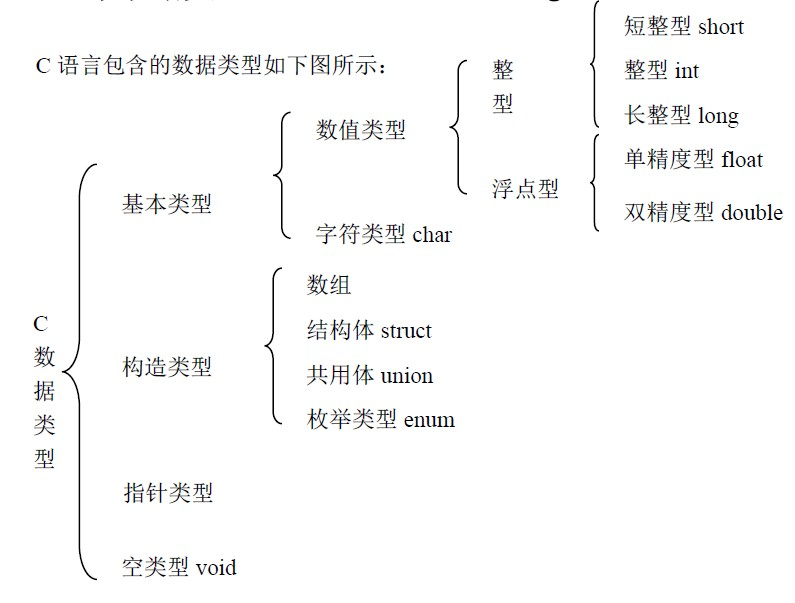

# 数据类型与变量常量

## C++中的数据类型

C++中的数据类型很少,但很繁琐,讲起来很容易乱套,这边有一张图很好的总结了C++中的数据类型,除了bool型外的数据类型都可以在其中找到对应




short、int、long、char、float、double这6种被称为基本类型,他们除了意义不同精度不同,更加关键的是他们所占用的内存大小不同.
在32 位的系统上:

+ short 在32位的系统上占用2个byte；
+ int 在32位的系统上占用4 个byte；
+ long 在32位的系统上占用4 个byte；64位系统 8个byte
+ float 在32位的系统上占用4 个byte；
+ double 在32位的系统上占用8 个byte；
+ char 在32位的系统上占用1 个byte。

针对int,long,short,char,还有一个修饰关键词`unsigned`可以放在他们前面,表示无符号.


另外处理大数可以使用longlong数据类型,表示一个8byte的数


### 基本类型转换

C++语言的类型转换，可以分为两种：

+ 自动类型转换（隐式类型转换，有编译器帮你去完成）
    
    对于自动类型转换，最常见的就是混合运算以及赋值运算，还有一种就是函数值的类型转换
    + 赋值运算：自动把“＝”右边的表达式的类型转换成“＝”右边的变量的类型，例如 int a=4.5; a的值实际是4！
    + 混合运算：就是一个运算表达式当中包含了多个类型，这时候就需要有类型转换。当运算符两边的操作数类型不同时，其中一个操作数就要经过类型转换以和另一个操作数的类型相一致，然后才能进行运算。
        变换操作数采取就高不就低的原则，即级别低的操作数先被转换成和级别高的操作数具有同一类型，然后再进行运算，结果的数据类型和级别高的操作数相同。
           高        double    ←←    float
           ↑          ↑             
           ↑         long     
           ↑          ↑
           ↑        unsigned
           ↑          ↑
           低         int      ←←    char,short

                 自动转换顺序表

    + 函数返回值的类型转换： int f1(){ return 36.8;}
    
+ 强制类型转换（你知道自己想要什么，所以才转换）。
    强制类型转换运算符
    可以利用强制类型转换运算符将一个表达式转换成所需类型:
    例如：
        (double)a       (将a转换成double类型)
        (int)(x+y)      (将x+y的值转换成整型)
        (float)(5%3)    (将5%3的值转换成float型)

    注意，表达式应该用括号括起来。如果写成(int)x+y 则只将x转换成整型，然后与y相加。

## 变量

和python中类似,C++中也有变量,变量的定义方式如下:

```c
int a,b,c...;
```

也就是

```c
(存储说明符 )数据类型 变量名1,变量名2...;
```

C++语言和python不同的是python的变量不需要事先声明,而C++语言必须事先声明,习惯上变量会在一起声明,而不是东一块西一块的,这样也有助于debug.

存储说明符则是对变量特性的声明,常见的存储说明符有:

+ static 

    静态局部变量,有时希望函数中的局部变量的值在函数调用结束后不消失而保留原值，这时就应该指定局部变量为"静态局部变量".它具有以下特点： 
    + 静态局部变量在函数内定义，但不象自动变量那样，当调用时就存在，退出函数时就消失。静态局部变量始终存在着，也就是说它的生存期为整个源程序。
    + 静态局部变量的生存期虽然为整个源程序，但是其作用域仍与自动变量相同，即只能在定义该变量的函数内使用该变量。退出该函数后， 尽管该变量还继续存在，但不能使用它。
    
    
+ register 

    寄存器变量,为了提高效率，C++ 语言允许将局部变量得值放在CPU中的寄存器中，这种变量叫"寄存器变量"
    
    
+ extern 

    外部变量（即全局变量）是在函数的外部定义的，它的作用域为从变量定义处开始，到本程序文件的末尾。如果外部变量不在文件的开头定义，其有效的作用范围只限于定义处到文件终了。如果在定义点之前的函数想引用该外部变量，则应该在引用之前用关键字 extern对该变量作“外部变量声明”。表示该变量是一个已经定义的外部变量。有了此声明，就可以从“声明”处起，合法地使用该外部变量。


总结：

>从作用域来划分分为:
                 
+ 局部变量

    + 静态局部变量static(离开函数，值还保留)
    + 寄存器局部变量register(离开函数，值消失)
    + 形式参数可以定义为自动变量或者register变量
             
+ 全局变量    

    +  静态外部变量(作用域只能在该文件中，文件作用域)
    +  外部变量(非静态外部变量,全局变量，可以被其它文件使用)

 
>从变量的生存周期来分：

+ 动态存储   

    + 寄存器变量register
    + 形式参数
                
+ 静态存储 

    + 静态局部变量
    + 静态外部变量
    + 外部变量(全局变量)

 

> 从变量值存放的位置：

+ 内存中的静态存储区(全局数据区)

    + 静态局部变量
    + 静态外部变量
    + 外部变量(全局变量)
    

+ 内存中的动态存储区(栈)

    + 形式参数

+ CPU中的寄存器 
    + 寄存器变量register


**注意:**当局部变量与全局变量重名的时候,和python一样,以局部变量为准,屏蔽全局变量

## 常量

常量是指值不可变的变量,C++语言中的常量其实一直以来都被误解,记得我学C的时候常量定义是这样的:

```c
#define Pi 3.14
```
其实这不是C++语言的常量,而是使用了所谓的宏,利用宏把3.14替换了Pi而已,你说这是常量吧也算,但C语言层面的常量定义方式实际上是这样的:
```c
const double Pi = 3.14;
```


Python中没有常量一说,我们就写一个例子来理解下什么是常量


```python
%%writefile src/C2/constant.cpp

#include <stdio.h>

const float Pi = 3.1415;

int main(void){
    int r;
    float s;
    r = 2;
    s = Pi*r*r;
    printf("半径2m圆的面积为:%f\n",s);

    Pi = 3.14;
    printf("Pi=%f\n",Pi);
    return 0;
}

```

    Overwriting src/C2/constant.cpp


```python
!g++-7 -o bin/constant src/C2/constant.cpp
```

    src/C2/constant.cpp: In function 'int main()':
    src/C2/constant.cpp:13:10: error: assignment of read-only variable 'Pi'
         Pi = 3.14;
              ^~~~


看,常数赋值后就无法再次赋值,将这句注释掉


```python
%%writefile src/C2/constant.cpp

#include <stdio.h>

const float Pi = 3.1415;

int main(void){
    int r;
    float s;
    r = 2;
    s = Pi*r*r;
    printf("半径2m圆的面积为:%f\n",s);

    //Pi = 3.14;
    printf("Pi=%f\n",Pi);
    return 0;
}

```

    Overwriting src/C2/constant.cpp


```python
!g++-7 -o bin/constant src/C2/constant.cpp
```


```python
!bin/constant
```

    半径2m圆的面积为:12.566000
    Pi=3.141500


## 类型推导[C++11]

### auto 

`auto`在C++11中是用于类型推断关键字,`auto`是一个类型的占位符,通知编译器去根据初始化代码推断所声明变量的真实类型.各种作用域内声明变量都可以用到它.例如,名空间中,程序块中,或是for循环的初始化语句中.也就是说我们可以像scala中一样直接用`var`定义变量了,只是变量必须后面有赋值,这点对pythoner来说简直就是必须的.

`auto`在C++14中得到了加强,现在它可以推导参数也可以推导返回值.


```python
%%writefile src/C2/auto_test.cpp
#include <iostream>
#include <vector>
#include <math.h>
using std::cout;
using std::endl;
using std::vector;

auto quadratic_sum(vector<int> &list){
    auto sum=0;
    auto quadratic = [](auto x){return pow(x,2);};

    for(auto i :list){
        sum += quadratic(i);
    }
    return sum;
}

int main(){
    vector<int> val = {1,2,3,4,5};
    cout<< quadratic_sum(val) <<endl;
    return 0;
}
```

    Overwriting src/C2/auto_test.cpp


```python
!g++-7 -o bin/auto_test src/C2/auto_test.cpp
```


```python
!bin/auto_test
```

    55


### decltype

decltype可以说是auto的反义,它的作用是可以根据变量推断类型来声明,比如我们不知道a的类型,但我们想让b和a类型相同局可以使用

```C++
auto x = 3;  
decltype(x) y; 
```
