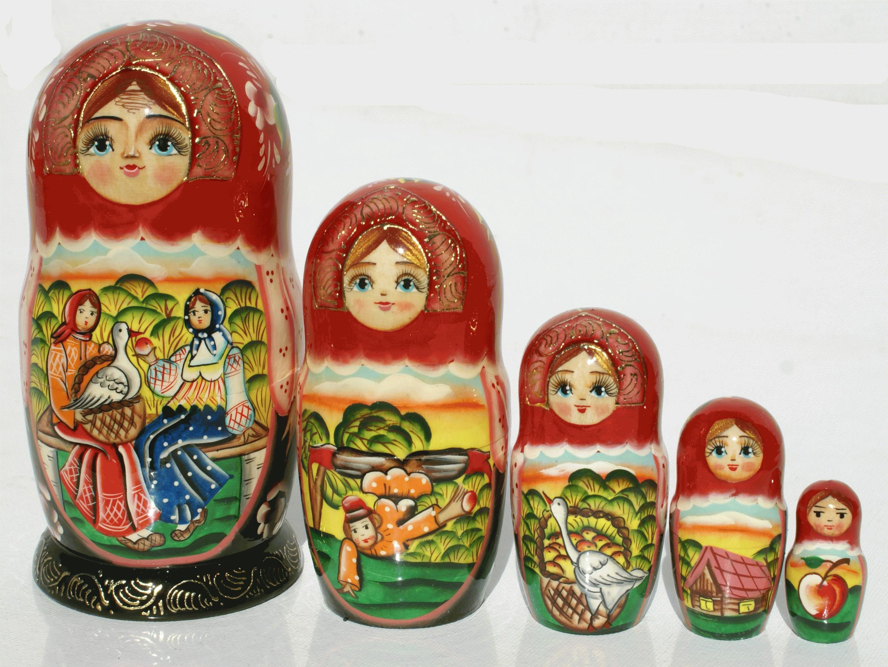

# 结语

C/C++的编译工具链可以很明显的看到这门语言是随着软件复杂度的增加一步一步进化而来的,简单项目makefile处理不过来了就弄了个生成makefile配置的cmake;依赖多到cmake也管不过来了就弄了个生成cmake配置的conan,看起来就像俄罗斯套娃一样.

至此,虽然并不是唯一的选择甚至不是最优选择,我们好歹算是把C/C++的编译环境以及对应的工具链给介绍完了.不过现在还不是松一口气的时候,好戏才刚刚开始.