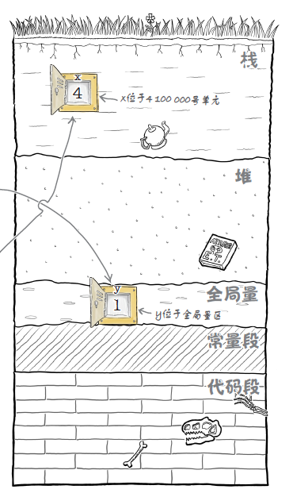

# 系统堆栈和C语言内存模型

C语言前文也已经分析过实际上也只是对汇编语言的一层封装.说到C的语言基础,我们不得不提到计算机的构成.

计算机大家都知道是由各种元件组成的,负责逻辑计算的cpu,负责暂存数据的内存.负责图像显示计算的显卡,负责发出声音的声卡,负责联通网络的网卡,以及一众输入输出设备.其实这些硬件的操作其实都是在系统启动时存在内存中,通过访问指定地址来实现的.汇编可以直接访问地址,而C可以通过指针来访问这些地址.

## 系统中的内存:栈与堆


计算机中的内存就是内存,但系统中的内存就不再是内存了,而是被系统抽象成了堆,栈以及一些其他分段,数据,函数都存在其中,由其他逻辑调度.


每个进程启动都会自动划出一块内存来划分成上面的结构.

+ 栈空间又系统管理,很小,空间大小,对象创建回收由系统分配调度,不同的系统默认分配不同的大小.
+ 堆空间则是手动档,可以非常大,大到上G,堆上的空间需要手动申请,用完了也得手动释放,要访问本质上也只能通过指针来访问.
+ 全局量存放全局变量
+ 常量段存放常量,像字符串也是常量
+ 代码段存放代码逻辑.函数什么都也就放那边.

在这其中常量段和代码段就是所谓的文本段,而全局量就是数据段

而如何找到这些段中对应的内容呢,这就需要记录存储器单元的地址.比如如下这段代码:

```Cpp

int y = 1;

int main(){
    int x = 4;
    return 0;
}

```

y就存放在数据段,x就存放在栈中,假设y的存储器地址为100000,那就是说1000000地址的存储器其中存放的是int类型的一个值为1的内容.

而这个地址的编号也就是使用取地址符`&`取出来的东西了.而所谓的指针也就是存放这个地址的空间了.

而我们需要知道这段地址中的内容是什么类型,这样程序才知道要如何处理,所以指针也需要类型.

如果我们使用库进行链接,那么内存的分配还会稍微复杂一些


## 堆中内存的分配和回收

C语言标准库提供了4个操作内存的接口:

+ malloc

    `void *malloc(size_t size);`在堆上开辟一个指定长度的空间,函数的返回值为该区域的首地址用于标识这块内存
    
+ calloc
    
    `void *calloc(size_t nmemb, size_t size)`用于在堆上向开辟n个,每个占size个字节的内存空间,并把分配的内存全都初始化为零值.函数的返回值为该区域的首地址用于标识这块内存
    
    
+ realloc

    `void *realloc(void *ptr, size_t size)`给一个已经分配了地址的指针重新分配空间,参数`ptr`为原有的空间地址,`size`是重新申请的地址空间大小,函数的返回值为该区域的首地址用于标识这块内存
    
+ free

    `void free(void *ptr)`释放指针指向的这块内存

我们应该养成良好的习惯,有创建就有回收,避免内存溢出.
