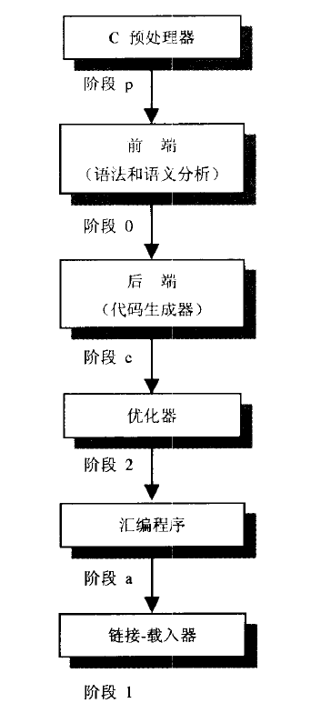

# 编译器

对于静态编译型语言来说,源代码只是文本,编译器才是灵魂,编译器直接决定了编译速度和编译出来的程序的性能.而由于C的特殊地位(现代操作系统都是基于C/C++的,因此操作系统的原生接口都是C/C++的),编译器也决定了编译出来的程序可以执行的环境.

最常见的C/C++编译器有:

+ `GNU C`开源大佬,linux上编译器的的代名词,在osx上也可以使用homebrew安装,windows上则有MinGW作为其移植版.
+ `llvm+Clang`苹果资助的编译器,也是osx下默认的编译器.有不少黑科技,比如C++的repl,jit技术等,一点不像保守的苹果资助的东西.
+ `MSVC`微软家的御用编译器,vs内置的编译器.只能在windows下使用,要在命令行中使用需要将其加入环境变量`Path`

这几个都是成熟的现代编译器,在编译出来的程序性能和编译速度都已经比较稳定,而且这3个编译器都是既可以编译C语言也可以编译C++的.

本节我们以C语言为例介绍编译器及其相关的内容,毕竟C语言相对来说看起来不会像C++那么晦涩,我们可以集中精力在理解编译器本身.

## C/C++语言的进化史

因为编译器都不统一,而各自又都会夹带一些私货(像极了js)所以实际上各个编译器对应的代码有可能不能通用.为了统一语法标准,ANSI(美国国家标准学会)对C语言制定标准,目前的标准有:

+ `C11`添加了字节对齐说明符,泛型机制(generic selection),对多线程的支持,静态断言,原子操作以及对Unicode的支持.
+ `C99` 添加了内联函数(inline functions),可变长度的数组,灵活的数组成员(用于结构体),复合字面量,指定成员的初始化器,对IEEE754浮点数的改进,支持不定参数个数的宏定义,在数据类型上还增加了 `long long int`以及复数类型.遗憾的是实际上很少有编译器可以完全支持这些特性,GCC和Clang能支持高达90%以上,MSVC2015只能支持到70% 左右
+ `C89(C90)` ANSI制定的初版,`K&R C`的超集,也是当今应用最广泛的一版标准
+ `K&R C` 由发明者发布的初版C,并不是ANSI制定的标准,一切的原点,梦开始的地方,确定了C语言的基本模式,至今一些老旧设备的烧录都使用这版标准.

另一方面作为希望成为一个更强大C语言的C++则采取了完全接收C语法并在其上做扩充的思路,最早它的定位就是`C with Class`也就是面向对象的C语言,然后慢慢的它接收了各种语法特性(模板,函数式编程等),让他成了现今最难以理解最难以维护的编程语言.ISO C++标准委员会则是为其定义标准的主体,目前的标准有:

+ `C++ 20` 第二次大版本更新,新增了模块语法,异步语法等重大特性(msvc 2019部分支持,gcc 11大部分支持,clang 11部分支持)
+ `C++ 17` 对`C++ 17`的第二次修补,主要是修复和小改进,总体变化不大(msvc 2019,gcc 8,clang 5)
+ `C++ 14` 对`C++ 11`的第一次修补,主要是修复和小改进,总体变化不大(msvc 2017,gcc 5,clang 3.4)
+ `C++ 11` 第一个大版本更新,新增大量特性,语法以及标准库,新增了lambda函数,auto类型推断声明,for range等重要特性,写法更加飘逸了,但至今依然没有全面推广铺开.好在许多大厂已经逐渐过渡到这个标准了.(msvc 2017,gcc 4.8,clang 3.3,Arduino IDE 1.6)
+ `C++ 03` 主要是在`C++ 98`的基础上针对实现方的一些问题进行了修复,从而在各个实现间达到一致,保持了可移植性,和`C++ 98`差别很小
+ `C++ 98` 最早由ISO C++标准委员订立的C++语法标准,类似`C89`,也是最广泛支持的版本

和js不同,C/C++的语言标准往往是标准先于实现的,基本上上面3家C编译器的实现都是尽量追C++的标准,而C的标准则实现优先级比较低,尤其是`msvc`属于相当放任的那种.

本攻略以`C++11`为基准,上探到`C++ 20`的一部分特性.在C++11以及之前的部分这边就不再指名版本,而高于这个的版本则会指出.

## GNU C/C++

GNU C/C++应该是最知名的开源C/C++编译器了,它往往是功能最全,最快支持新特性的一个主流编译器.它的根据地是linux.除了标准的gcc/g++编译器外,它还提供[用于交叉编译到arm指令集及其的工具](https://developer.arm.com/tools-and-software/open-source-software/developer-tools/gnu-toolchain/gnu-a/downloads):

+ `arm-none-eabi`用于编译32位ARM架构的裸机系统(写系统,烧录用),一般适合内核编程,所以不支持那些跟操作系统关系密切的函数比如`fork(2)`他使用的是`newlib`这个专用于嵌入式系统的C库
+ `arm-none-linux-gnueabihf`主要用于基于32位ARM架构的Linux系统,用于在系统之上编写应用,使用`Glibc`
+ `aarch64-none-elf`用于编译64位ARM架构的裸机系统(写系统,烧录用),一般适合内核编程,所以不支持那些跟操作系统关系密切的函数比如`fork(2)`他使用的是`newlib`这个专用于嵌入式系统的C库
+ `aarch64-none-linux-gnu`主要用于基于64位ARM架构的Linux系统,用于在系统之上编写应用,使用`Glibc`
+ `aarch64_be-none-linux-gnu`主要用于基于64位ARM架构的Linux系统(大端字节序),用于在系统之上编写应用,使用`Glibc`

他平台上也并不是没有gcc的实现:

+ mac osx上可以使用`homebrew`安装gcc,安装好后,由于osx固定的将gcc命令链接到clang.要使用的话只能使用`gcc-7`形式的命令,其中7是指gcc的大版本.

+ windows上则可以安装`mingw`来获取gnu的环境,可以通过`anaconda`安装或者通过windows上模拟linux环境的gnu工具箱[cygwin64](https://www.cygwin.com/install.html)获得,需要注意的是`mingw`的安装可能会在你为python安装需要用C编译的包时带来一些错误.所以谨慎使用.

本文使用`gcc 10`作为样例,它在各个平台都有实现(windows上通过安装[cygwin64](https://www.cygwin.com/install.html)获得),其对应的C语言编译器为`gcc`,C++编译器为`g++`.

## C/C++语言与编译

对于C/C++来说,编译其本质就是将源文件转化为二进制库文件或者可执行文件的过程,我们以一个小程序来作为例子,使用`gcc`工具(c语言的编译器)来演示整个编译过程:

+ [source/src/helloworld.c]()

    ```c
    #include <stdio.h>

    int main(){
        printf("hello world");
        return 0;
    }
    ```

一般来说编译器并不是铁板一块,而是模块化设计



前面几个步骤是用于检测代码是否有语法错误的.而实际编译代码可以分为如下步骤:

+ 解析代码文件生成待编译代码
+ 将代码转译为汇编语言
+ 汇编代码生成对象
+ 将对象与其他依赖的对象进行连接

### 步骤一:解读头文件,结合源文件,组合生成真正的待编译代码

这一步可以使用`-E`指令实现.这个过程只激活预处理,不生成文件,而是输出到标准输出.因此你需要把它重定向到一个输出文件里.一般来说我们用后缀`.i`保存这个文件.

这一步实际上做这些事儿:

+ 宏的替换
+ 注释的消除
+ 还有找到相关的库文件
+ 执行模板,将模板翻译成源码的实现
+ 将#include文件的全部内容插入.若用`<>`括起文件则在系统的INCLUDE目录中寻找文件,若用`" "`括起文件则在当前目录中寻找文件.

```shell
gcc -E ./src/helloworld.c
```

### 步骤二:将代码转译成汇编语言

这一步可以使用`-S`指令实现.这个过程就是将上一步的这串字符转译成汇编代码.汇编代码说白了就是二进制代码中操作与资源的的替代而已.因此说C/C++和汇编其实也就一步之遥.这也是为什么很多时候嵌入式设备使用C/C++语言编写的原因.

生成`helloworld.s`文件,`.s`文件表示是汇编文件，用编辑器打开就都是汇编指令了

```shell
gcc -o ./src/helloworld.s -S ./src/helloworld.c
```

### 步骤三:将汇编语言的代码再编译为二进制代码

这一步使用`-c`指令,将汇编代码编译位二进制代码.注意这依然不是可执行文件,因为其中使用的函数很可能并不包含在二进制文件中.

```shell
gcc -o ./src/helloworld.o -c ./src/helloworld.c
```

### 步骤四: 链接相关的二进制代码生成可执行文件

这一步就是将与文件相关的函数库引入以生成最终的可执行文件.

```shell
gcc -o ./build/bin/helloworld ./src/helloworld.o
```

执行:

```bash
./build/bin/helloworld
```

```txt
hello world
```

## C/C++项目结构

C/C++是系统级的静态语言,需要编译为可执行文件才可以执行.而且比较原始,在语言设计之初就没有考虑什么依赖管理,项目管理这类的问题,因此在开始学习前我们先来约定下项目的结构.

而且去github上可以发现各个项目的文件组织结构都不尽相同,按我的习惯通常简单的项目我们会把源代码放在一起,使用的第三方依赖的内容放在一起,而编译好的结果放在一起.比如:

+ `build`文件夹 存放编译的结果
    + `bin`  存放可执行文件
    + `lib`  存放编译好的动态库或者静态库
    + `inc`  存放编译好的库的头文件

+ `lib`文件夹  编译过程中依赖的动态链接库和静态库
+ `inc`文件夹  编译过程中依赖的动态链接库和静态库的头文件
+ `src`文件夹  编译用到的源文件,以及中间过程中生成的文件
+ `test`文件夹  存放测试文件
    虽然C语言是静态语言,但测试驱动编程依然是一个好的方法论.编译好的测试用可执行文件可以放在`build/bin`里面,同时文件名应该包含`test`字样
+ `python`文件夹  存放项目的python的C包装,如果需要的话才会有,由于大多数语言都可以使用ABI对接C语言,这种针对某种特定语言的包装器就放在以语言名命名的文件夹中.

    + `<项目名>_wrapper.c`和`py<项目名>.py` c写的包装源码配合python写的包装,一般用于将函数封装成类
    + `py<项目名>.pyx`和 `py<项目名>.pyd`  cython写的包装(如果使用cython的话)
    + `test` 测试文件夹,用于测试包装效果
    + `setup.py` python模块安装文件
    一般来说,个人认为以C为主的项目最好不要把包放到pypi,以防止安装出问题.这种项目的python接口还是强制源码安装比较靠谱.
+ `docs` 项目的html文档,用于给github渲染成网站
+ `document`  项目文档文件夹
+ `CMakeLists.txt/makefile`, `cmake/make`项目设置文件
+ `Doxyfile`  `doxygen`项目设置文件

## 入口函数与库引用

类似于golang,C/C++程序必须包含一个签名为`int main()`的入口函数,这是程序执行的入口.而如果要调用main函数外部的程序,则需要额外定义函数或者类.
我们不可能把所有的执行过程全部都写在同一个文件里,那将完全无法维护,这就需要将程序模块化,现在编程语言往往是通过引用模块的形式来实现调用外部对象.
C/C++没那么高级,它想出的办法是通过接口和库来实现模块化.

### 库的接口与实现

所谓接口,它的作用是描述这个库可以干什么,而实现则是具体将描述的功能完成.
C/C++可以接口与实现分离,也就是说同样一份接口,后面实际使用的实现形式可以是千差万别的,其中:

+ 接口部分使用头文件(C语言通常以`.h`作为后缀,C++则通常使用`.h`和`.hpp`,注意这两者有一定区分),头文件是编译时处理的文件,因此只能写编译时可以执行的代码,主要包括:

    + 宏
    + 全局变量申明(带`extern`限定符)
    + 全局函数的申明
    + 带`inline`限定符的全局函数的定义
    + 类的定义(c++)
    + 类函数成员和数据成员的申明(在类内部)(c++)
    + 类定义内的函数定义(相当于`inline`)(c++)
    + 带`static const`限定符的数据成员在类内部的初始化(c++)
    + 带`inline`限定符的类定义外的函数定义(c++)
    + 带`inline`限定符的全局模板函数的申明和定义(c++)
    + 模板类的定义(c++)
    + 模板类成员的申明和定义(定义可以放在类内或者类外,类外不需要写inline)(c++)


+ 实现部分可以有几种情况:

    + 单一源码文件(C语言通常以`.c`作为后缀,C++则通常使用`.cc`和`.cpp`,本质上没啥不同)
    + 多个源码文件组合,他们都会引用同一个接口头文件
    + 静态库(通常以`libxxx`命名,在linux中,用`.a`为后缀;windows中以`.lib`为后缀.osx中也以`.a`或`.framework`为后缀)
    + 动态链接库(通常以`libxxx`命名,在linux中用`.so`为后缀.在windows中用`.dll`为后缀.在osx中用`.dylib`为后缀.)

而接口和实现也不是绑定的,这样就带来了灵活性.一般来说一个模块含有一个接口文件,它的后面可能按功能等分成多个实现用的源文件,而编译好后又是一个动态/静态库.而要用这个库的时候我们再为它写带main函数的源文件.

### 标准库

C/C++的设计思路是维持语言本身纯净,涉及具体业务的则都通过库来实现.因此除了编译器外还会有个标准库用于最低限度的保证C/C++可以完成任务.比如helloworld中第一句`#include <stdio.h>`就是引用的标准库`stdio`,这个库用于管理标准输入输出.linux下c语言的标准库通常都包含在动态链接库`libc.so`下,而更加底层的运行时动态链接库`glibc`(alpine中是`Musl libc`)则封装了很多系统相关的接口.

### 引用库

C/C++通过`#include`来引用外部模块,它会按如下顺序查找符合命名的头文件.

+ 如果是`#include <xxx>`则按下面顺序查找

    1. `-I`指定的目录
    + 环境变量`C_INCLUDE_PATH(对应gcc)`或`CPLUS_INCLUDE_PATH(对应g++)`指定的目录.
    + 搜索gcc/g++的内定目录,也就是`/usr/include`->`/usr/local/include`->`/usr/lib/gcc/{平台}/{版本}/include`

+ 如果是`#include "xxxx"`则按如下顺序查找

    1. 当前目录
    + `-I`指定的目录
    + 环境变量`C_INCLUDE_PATH(对应gcc)`或`CPLUS_INCLUDE_PATH(对应g++)`指定的目录.
    + 搜索gcc/g++的内定目录,也就是`/usr/include`->`/usr/local/include`->`/usr/lib/gcc/{平台}/{版本}/include`

在找到头文件后,编译器会将其中的内容复制到引用文件中(注意C/C++并不能部分引用),然后再找其对应的实现部分.

### 避免重复引用

当多个模块都依赖同一个头文件时,由于c/c++的`#include`是全量复制,这就会出问题.为了避免重复引用,我们通常像下面这样定义头文件:

```c
 /* $Id$ */
#ifndef BINARY_VECTOR_H
#define BINARY_VECTOR_H//一般是文件名的大写 头文件结尾写上一行

xxxxx//定义部分
#endif
```

这样无论我们`include`几次都只会复制一次.

### 例子: 二维向量操作

接下我们用二维向量操作的例子来介绍4种实现的使用方式.他们公用同一个头文件:

+ `binary_vector.h`

    ```c
    /* $Id$ */
    #ifndef BINARY_VECTOR_H
    #define BINARY_VECTOR_H//一般是文件名的大写 头文件结尾写上一行

    struct BINARY_VECTOR {
        float x;
        float y;
    };

    typedef struct BINARY_VECTOR *BINARY_VECTOR_P;

    BINARY_VECTOR_P VEC_new(void);
    BINARY_VECTOR_P VEC_init(float x,float y);
    void VEC_del(BINARY_VECTOR_P);

    float VEC_mod(BINARY_VECTOR_P);
    BINARY_VECTOR_P VEC_add(BINARY_VECTOR_P,BINARY_VECTOR_P);
    float VEC_mul(BINARY_VECTOR_P ,BINARY_VECTOR_P);


    #endif
    ```

而入口文件我们也都用一样的

```c
#include <stdio.h>
#include "binary_vector.h"


int main(void){
    struct BINARY_VECTOR A = {1,2},B = {3,4};
    printf("mod(A)=%f\n",VEC_mod(&A));
    printf("mod(B)=%f\n",VEC_mod(&B));
    printf("mul(A,B)=%f\n",VEC_mul(&A,&B));
    BINARY_VECTOR_P result = VEC_add(&A,&B);
    printf("add(A,B)=<%f,%f>\n",result->x,result->y);
}
```

> 单一源码

+ `binary_vector.c`

    ```c
    #include "binary_vector.h"
    #include <stdlib.h>
    #include <math.h>
    #define T BINARY_VECTOR_P
    T VEC_add(T a, T b)
    {
        float x = a->x + b->x;
        float y = a->y + b->y;
        T result;
        result = VEC_new();
        result->x = x;
        result->y = y;
        return result;
    }

    float VEC_mul(T a, T b)
    {
        float result = a->x * b->x + a->y * b->y;
        return result;
    }

    T VEC_new(void)
    {
        T ptr;
        ptr = (T)malloc(((long)sizeof *(ptr)));
        ptr->x = 0.0;
        ptr->y = 0.0;
        return ptr;
    }

    T VEC_init(float x, float y)
    {
        T ptr;
        ptr = (T)malloc(((long)sizeof *(ptr)));
        ptr->x = x;
        ptr->y = y;
        return ptr;
    }

    void VEC_del(T ptr)
    {
        if (ptr)
            free(ptr);
    }
    float VEC_mod(T a)
    {
        float result = sqrt(a->x * a->x + a->y * a->y);
        return result;
    }
    #undef T
    ```

上面的代码中我们利用宏`#define T BINARY_VECTOR_P`重命名了`BINARY_VECTOR_P`为`T`,这种方式在c语言中很常见,毕竟c语言没有类,在c++中我们就没必要用这么迂回的方式了.
一般来说C语言中我们不得不大量使用宏,那是没办法,宏会造成代码晦涩难懂,难以维护;而写c++代码则因该能不写宏就不写宏.

我们使用`gcc -I./inc -o ./build/bin/single_source ./test/test.c ./src/binary_vector.c`编译

> 多个源码组合

+ `src/struct_operator.c`

    ```c
    #include "binary_vector.h"
    #include <stdlib.h>
    #define T BINARY_VECTOR_P
    T VEC_new(void){
        T ptr;
        ptr = (T) malloc(((long)sizeof *(ptr)));
        ptr->x = 0.0;
        ptr->y = 0.0;
        return ptr;
    }

    T VEC_init(float x,float y){
        T ptr;
        ptr = (T) malloc(((long)sizeof *(ptr)));
        ptr->x = x;
        ptr->y = y;
        return ptr;
    }

    void VEC_del(T ptr){
        if (ptr) free(ptr);
    }
    #undef T
    ```

+ `src/unary_operator.c`

    ```c
    #include "binary_vector.h"
    #include <math.h>
    #define T BINARY_VECTOR_P
    float VEC_mod(T a){
        float result = sqrt(a->x*a->x+a->y*a->y);
        return result;
    }
    #undef T
    ```

+ `src/binary_operator.c`

    ```c
    #include "binary_vector.h"
    #define T BINARY_VECTOR_P
    T VEC_add(T a, T b) {
        float x = a->x + b->x;
        float y = a->y + b->y;
        T result;
        result = VEC_new();
        result->x = x;
        result->y = y;
        return result;
    }

    float VEC_mul(T a, T b) {
        float result = a->x * b->x + a->y * b->y;
        return result;
    }
    #undef T
    ```

编译上面的源码`gcc -I./inc -o ./build/bin/mul_source ./test/test.c ./src/*_operator.c`

C的特点之一就是申明与实现分离,这也决定了其开发方式和python截然相反,python一般是想到哪里写到哪里,比较适合敏捷开发,而C明显更适合先整体构思好了再动手写.因此才说python适合原型开发快速迭代,而C适合写(接口明确稳定的)业务.

## 链接库

Java当初以跨平台作为重要的卖点,号称一次编译随处运行.其实C/C++当初也是这么宣传的,只不过对于C/C++来说跨平台指的是写好源码,头文件后可以在各个平台编译运行(系统资源接口的调用除外).但是显然这种跨平台很不彻底.

实际上还有另外一种复用的方式,就是将代码编译成链接库.再在步骤四的时候链接到最终的代码中.链接库分为静态链接库和动态链接库两种.

静态链接库与动态链接库都是共享代码的方式

链接库是由第三步的`.o`文件组合而成,各个系统平台使用不同的规范实现,具体是什么规范这边不细说.总之不同平台编译出来的链接库是不能兼容的.但其实问题也不太大,完全可以编译好后共享出去.

## 链接库的使用方法

无论静态链接库还是动态链接库,命名规则都是`libxxx+后缀`,但编译的时候指定的名字就是`xxx`.
很多时候我们为了隐藏代码实现,在共享的时候可以指定好平台操作系统,之后只共享出链接库和头文件.这种方式不仅可以防止代码被人篡改或者侵权,更可以精简接口.

## 静态连接库

在linux中,而静态链接库用`.a`为后缀.windows中以`.lib`为后缀.osx中也以`.a`或`.framework`为后缀.当要使用静态链接库时,连接器会找出程序所需的函数,然后将它们拷贝到执行文件,由于这种拷贝是完整的,所以一旦连接成功,静态程序库也就不再需要了.

### 静态链接库的优点

+ 代码装载速度快,执行速度略比动态链接库快;

+ 只需保证在开发者的计算机中有正确的动态库文件,在以二进制形式发布程序时不需考虑在用户的计算机上的库文件是否存在及版本问题.这种方式依赖少,非常适合分发.

### 不足之处

+ 使用静态链接生成的可执行文件体积较大,包含相同的公共代码,造成浪费

### 构建静态链接库

我们还是继续完成上面的例子,一般我们用`ar`(archive,归档的意思)把多个目标文件集合起来生成静态链接库文件.


```bash
gcc -c -o src/struct_operator.o -I./inc ./src/struct_operator.c
gcc -c -o src/binary_operator.o -I./inc ./src/binary_operator.c
gcc -c -o src/unary_operator.o -I./inc ./src/unary_operator.c
ar crv ./lib/libvector.a src/*.o
```


### ar命令常用参数

ar用来管理一种文档,这种文档中可以包含多个其他任意类别的文件.这些被包含的文件叫做这个文档的成员.ar用来向这种文档中添加,删除,解出成员.成员的原有属性(权限,属主,日期等)不会丢失.

实际上通常只有在开发中的目标静态连接库是这种格式的,所以尽管不是,我们基本可以认为ar是用来操作这种目标链接库(.a文件)的.

#### 指令参数

+ `-d` 　删除库文件中的成员文件
+ `-m` 　变更成员文件在库文件中的次序
+ `-p` 　显示库文件中的成员文件内容
+ `-q` 　将问家附加在库文件末端
+ `-r` 　将文件插入库文件中
+ `-t` 　显示库文件中所包含的文件
+ `-x` 　自库文件中取出成员文件


#### 选项参数

+ `a<成员文件>` 　将文件插入库文件中指定的成员文件之后。
+ `b<成员文件>` 　将文件插入库文件中指定的成员文件之前。
+ `c` 　建立库文件。
+ `f` 　为避免过长的文件名不兼容于其他系统的ar指令指令，因此可利用此参数，截掉要放入库文件中过长的成员文件名称。
+ `i<成员文件>` 　将问家插入库文件中指定的成员文件之前。
+ `o` 　保留库文件中文件的日期。
+ `s` 　若库文件中包含了对象模式，可利用此参数建立备存文件的符号表。
+ `S` 　不产生符号表。
+ `u` 　只将日期较新文件插入库文件中。
+ `v` 　程序执行时显示详细的信息。
+ `V` 　显示版本信息。

### 常见操作

1. 创建库文件

    通常人们使用`ar crvu liba.a a.o`这样的命令来创建一个库并把`a.o`添加进去.`c`关键字告诉`ar`需要创建一个新库文件,如果没有指定这个标志则`ar`会创建一个文件,同时会给出一个提示信息,`u`用来告诉ar如果`a.o`比库中的同名成员要新,则用新的`a.o`替换原来的.实际上用`ar -r liba.a a.o`通常就够

2. 加入新成员

    使用`ar -r liba.a b.o`即可以将`b.o`加入到`liba.a`中.默认的加入方式为`append`，即加在库的末尾.`r`关键字可以有三个修饰符`a`, `b`和`i`

    + "a"表示after,即将新成员加在指定成员之后.例如`ar -ra a.c liba.a b.c`表示将`b.c`加入`liba.a`并放在已有成员`a.c`之后；
    + "b"表示before,即将新成员加在指定成员之前.例如`ar -rb a.c liba.a b.c`;
    + "i"表示insert,跟"b"作用相同

3. 列出库中已有成员

    `ar -t liba.a`即可。如果加上"v"修饰符则会一并列出成员的日期等属性。

4. 删除库中成员

    `ar -d liba.a a.c`表示从库中删除`a.c`成员.如果库中没有这个成员ar也不会给出提示.如果需要列出被删除的成员或者成员不存在的信息,就加上"v"修饰符.

5. 从库中解出成员

    `ar -x liba.a b.c`

6. 调整库中成员的顺序

    使用"m"关键字。与"r"关键字一样，它也有3个修饰符"a","b", "i"。如果要将`b.c`移动到`a.c`之前，则使用`ar -mb a.c liba.a b.c`

> 使用静态链接库

要调用静态库我们依然需要头文件,我们需要一个头文件来描述这个静态库中的接口.我们可以使用之前的头文件`vector.hpp`.要使用静态链接库我们需要用`-L`来指定静态库所在的地址,再使用`-l`来指定静态库的名字.注意静态库的名字.

```bash
gcc -I./inc -L./lib -o ./build/bin/static_source ./test/test.c -lvector
```

需要注意,使用静态库的时候是要注意文件顺序的,通常我们要习惯将`-l`的内容放在编译命令的**最后面**.因为如果相同的命名在不同的库中有不同的定义,那么顺序不同结果就不同了.

## 动态连接库

在linux中,动态链接库通常用`.so`为后缀.在windows中,动态链接库通常用`.dll`为后缀.在osx中,动态链接库通常用`.dylib`为后缀.

某个程序在运行中要调用某个动态链接库函数的时候,操作系统首先会查看所有正在运行的程序,看在内存里是否已有此库函数的拷贝了.如果有,则让其共享那一个拷贝;只有没有才链接载入.在程序运行的时候,被调用的动态链接库函数被安置在内存的某个地方,所有调用它的程序将指向这个代码段.因此,这些代码必须使用相对地址,而不是绝对地址.在编译的时候,我们需要告诉编译器,这些对象文件是用来做动态链接库的,所以要用地址不无关代码(Position Independent Code (PIC)).

注意:Linux下进行连接的缺省操作是首先连接动态库,也就是说,如果同时存在静态和动态库,不特别指定的话,将与动态库相连接.

### 动态链接库的优点

+ 更加节省内存并减少页面交换;

+ 动态链接文件与可执行文件独立,只要输出接口不变(即名称,参数,返回值类型和调用约定不变),更换动态链接文件不会对可执行文件造成任何影响,因而极大地提高了可维护性和可扩展性;

+ 不同编程语言编写的程序只要按照函数调用约定就可以调用同一个动态函数;

+ 适用于大规模的软件开发,使开发过程独立,耦合度小,便于不同开发者和开发组织之间进行开发和测试.

### 不足之处

+ 使用动态链接库的应用程序不是自完备的,它依赖的动态模块也要存在,如果使用载入时动态链接,程序启动时发现动态模块不存在,系统将终止程序并给出错误信息.而使用运行时动态链接,系统不会终止,但由于动态库中的导出函数不可用,程序会加载失败

+ 速度比静态链接慢.当某个模块更新后,如果新模块与旧的模块不兼容,那么那些需要该模块才能运行的软件,统统撕掉.

### 编译动态链接库

动态链接库可以直接使用gcc编译.需要使用`-fPIC`指定编译成的是位置无关的共享库,`-shared`指定连接方式是共享型

```bash
gcc -o lib/libvector_b.so -fPIC -shared -I./inc src/*_operator.c
```

注意在windows上需要改名字为`libvector_b.dll`

> 使用动态库

```bash
gcc -o ./build/bin/dynamic -I./inc -L./lib ./test/test.c -lvector_b
```

# 使用宏实现跨平台

我们说过C/C++的跨平台是源码级别的跨平台,但实际上因为操作系统功能的实现有区别,接口也有些区别,因此很多时候我们还是得考虑跨平台问题.其实这个问题python中也有,比如到3.6版本为止windows的`ctrl+c`操作都无法直接用于协程程序的中断.

在C/C++编程时我们可以像上面定义C接口时一样用宏语句判断是否需要特殊化处理.一般情况下会出问题的也就是windows,下面是特殊化处理的宏片段:

```c
#ifdef _MSC_VER
    #pragma warning(disable:4996)
    #include <windows.h>
    #include <io.h>
#else
    #include <unistd.h>
    #include <sys/time.h>
    #include <pthread.h>
    #define  CRITICAL_SECTION   pthread_mutex_t
    #define  _vsnprintf         vsnprintf
#endif
```

当然了更加方便的方式是无视windows

## 编译可执行文件


## 总结

### gcc/g++的常用参数

+ -o 指定输出的文件
+ -E 预编译
+ -S 编译为汇编代码
+ -c 编译位二进制文件
+ -L 选项告诉编译器去哪里找需要的库文件
+ -l -lbvector告诉编译器要链接libbvector库
+ -I 选项告诉去哪个文件夹下找头文件
+ -i 指定使用的头文件
+ -static 链接方式禁止使用动态库。

    优点：程序运行不依赖于其他库

    缺点：文件比较大

+ -shared (-G) 此链接方式尽量使用动态库，为默认选项(共享型)

    优点：生成文件比较小

    缺点：运行时需要系统提供动态库

+ -symbolic 此链接方式将在建立共享目标文件的时候,把引用绑定到全局符号上.
+ -fpic 编译器就生成位置无关目标码.适用于共享库(shared library).通常能产生更快更小的代码,但有平台限制.编译出的代码将通过全局偏移表(Global Offset Table)中的常数地址访存，动态装载器将在程序开始执行时解析GOT表项.
+ -fPIC 编译器就输出位置无关目标码.适用于动态连接(dynamic linking),即使分支需要大范围转移.该选项会针对某些特殊机型做了特殊处理,比如适合动态链接并能避免超出GOT大小限制之类的错误.而Open64仅仅支持不会导致GOT表溢出的PIC编译.


